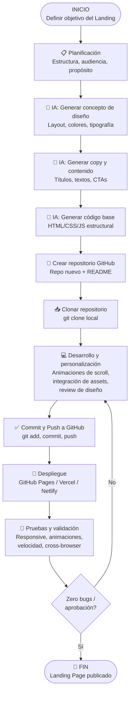

# Diagrama de Flujo: Creación de Landing Page con GitHub e IA



## Descripción del Flujo

### Fase 1: Planeación y Concepto con IA
- **Definir el objetivo**: ¿Qué acción debe tomar el visitante? (comprar, suscribirse, contactar)
- **Usar IA para diseño**: Generar referencias visuales, paletas de colores, estructura de secciones
- **Usar IA para copy**: Redactar headlines, descripciones, CTAs persuasivos
- **Usar IA para código**: Obtener estructura HTML/CSS base como punto de partida

### Fase 2: Infraestructura en GitHub
- **Crear repositorio**: `github.com/usuario/landing-page` con README descriptivo
- **Clonar local**: `git clone https://github.com/usuario/landing-page.git`
- **Estructura recomendada**:
  ```
  /landing-page
  ├── index.html
  ├── /css
  │   └── styles.css
  ├── /js
  │   └── animations.js
  ├── /assets
  │   ├── /images
  │   └── /fonts
  └── README.md
  ```

### Fase 3: Desarrollo e Implementación
- **Animaciones de scroll**: Implementar con Intersection Observer API, GSAP, o CSS animations
- **Referencias**: motionsites.ai, 21firstdesigns para inspiración
- **Personalización**: Adaptar el código generado por IA a necesidades específicas

### Fase 4: Control de Versiones
- **Git workflow**:
  ```bash
  git add .
  git commit -m "feat: agregar sección hero con animación"
  git push origin main
  ```
- **Commits atómicos**: Cada funcionalidad en un commit separado

### Fase 5: Despliegue y Entrega
- **GitHub Pages**: Gratuito, directo desde el repo
- **Vercel/Netlify**: Deploy automático al hacer push a main
- **Pruebas finales**: Mobile, desktop, velocidad de carga, animaciones suaves

## Herramientas recomendadas

| Categoría | Herramienta |
|-----------|-------------|
| IA generativa | ChatGPT, Claude, Copilot |
| Inspiración diseño | motionsites.ai, 21firstdesigns, Awwwards |
| Animaciones | GSAP, Intersection Observer, Framer Motion |
| Despliegue | GitHub Pages, Vercel, Netlify |
| Versionado | Git + GitHub |

## Tips clave

1. **La IA acelera el inicio** pero el pulido final requiere juicio humano
2. **Usa referencias reales** (motionsites.ai) para calibrar calidad
3. **Commits frecuentes** permiten revertir si algo falla
4. **Deploy automático** = feedback inmediato al hacer push
5. **Prueba siempre en móvil** — el 60%+ del tráfico viene de ahí
